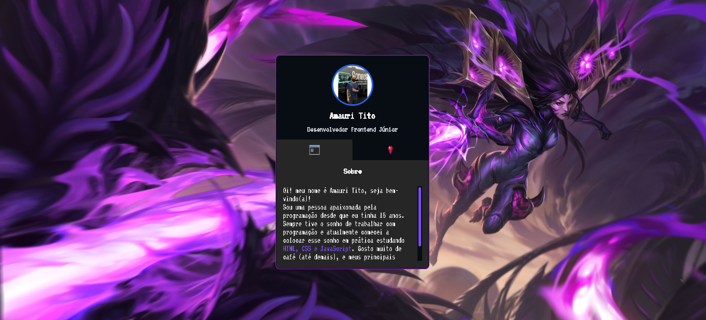
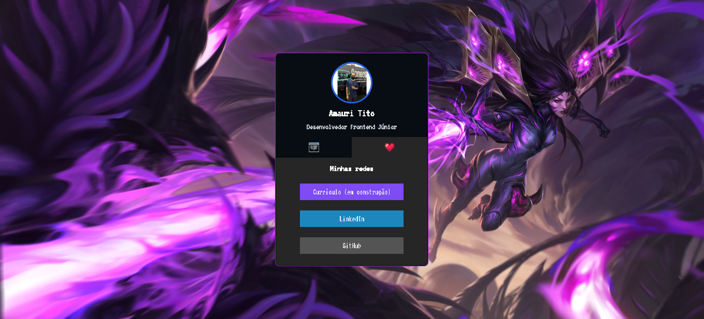

# Mini-Portifolio

> Mini-Portifolio Semana DevWeek

Projeto construido do evento DevWeek, afim de melhorar e aprofundar os meus conhecimentos.

[ 🔗 Clique aqui para acessar ](https://amauridraken.github.io/mini-portifolio-devweek/)

## 👨‍💻 Tecnologias 

- Html
- Css
- JavaScript
- Git e GitHub

## 💛 Contato
amauri.tito07@gmail.com